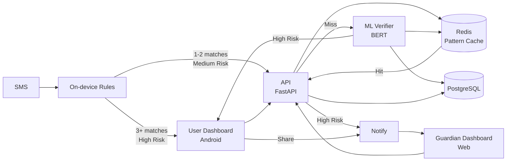

# Guardian SMS

A safety assistant that helps older adults identify scam SMS messages in real-time.

## Overview

Guardian SMS monitors incoming text messages on Android, analyzes them for scam indicators using hybrid AI detection, and alerts both the elderly user and their trusted family members. Messages are analyzed instantly without requiring technical expertise.

**What it solves:** Older adults are disproportionately targeted by SMS scams. Guardian provides instant protection and family oversight without requiring decisions under pressure.

**Target audience:** Senior citizens (protected users) and their family members (guardians).

## How It Works

### Message Monitoring
- **Android app:** Monitors incoming SMS messages in real-time
- **Local detection:** On-device rules engine (<50ms)
- **Backend verification:** ML analysis for uncertain cases (200ms)

### Analysis
- Hybrid detection: Local rules engine + Backend ML classifier
- Rule-based patterns: urgency language, suspicious links, money requests, impersonation
- Pretrained BERT model for scam/phishing detection
- Redis caching for fast repeated pattern detection

### Results
- Risk level (Safe / Medium Risk / High Risk)
- Warning signs identified in the message
- Safe next steps in plain language
- Real-time alerts to protected user

### Dashboards
- **Protected User Dashboard (Android App):** Shows analyzed messages, risk levels, and alerts. Allows users to view message details, see safe next steps, and share messages with guardians.
- **Guardian Dashboard (Web):** Family members can check in on protected users, view shared messages, see risk summaries, and verify false positives. Access is controlled by the protected user.

### Alerts
Guardian automatically notifies trusted family members when high-risk scams are detected. Medium-risk messages prompt the user to share. Family members can view shared messages with user consent to verify false positives.

## Privacy & Safety

- **Metadata-only storage** - Raw message content never stored permanently
- **Encrypted sharing** - Messages shared with family are encrypted (AES-256)
- **Auto-expiration** - Logs deleted after 7 days, shared messages after 48 hours or viewing
- **User control** - Protected users control guardian access levels
- **No modifications** - Original messages in system SMS app never touched

## Tech Stack

| Layer | Technology |
|-------|------------|
| Mobile App | Kotlin (Android) |
| Guardian Dashboard | Next.js (Web) |
| Real-time Updates | SSE (Server-Sent Events) |
| Backend | FastAPI (Python) |
| Database | PostgreSQL |
| Cache | Redis |
| ML | HuggingFace BERT classifier |
| Infrastructure | Railway / Render |

## Architecture



## Local Setup

### Quick Start

Run the setup script to automatically install all dependencies:

```bash
./setup.sh
```

**Note:** Ensure `setup.sh` is kept up to date with the latest setup requirements.

This will:
- Create a Python virtual environment (`.venv`)
- Install all dependencies from `backend/requirements.txt`
- Create `.env` file from `.env.example` if it doesn't exist
- Optionally test database connection
- Optionally run database migrations

### Using the Scripts

**Setup (first time only):**
```bash
./setup.sh
```

**Start the server:**
```bash
./start_server.sh
# Options: --port 8080, --host 0.0.0.0, --no-reload, --no-redis
```

**Stop the server:**
```bash
./stop_server.sh
```

The `start_server.sh` script automatically starts Redis in Docker if available. Use `stop_server.sh` to cleanly stop all services.

### Requirements
- Python 3.11+
- PostgreSQL 15+ (AWS RDS)
- Redis 7+
- Docker (optional, for local Redis)

### Backend Setup

```bash
# Create virtual environment
python3 -m venv .venv
source .venv/bin/activate

# Install dependencies
pip install -r backend/requirements.txt

# Configure environment
cp .env.example .env
# Edit .env with your database credentials

# Start Redis (optional, using Docker)
docker-compose up -d redis

# Run database migrations
cd backend
alembic upgrade head

# Start the server
./start_server.sh
# Or manually: uvicorn app.main:app --reload
```

### Android Setup
- Open `android/` in Android Studio
- Update API URL in `strings.xml`
- Build and run on emulator/device

## License

MIT
