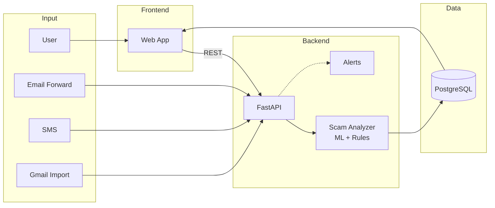

# Guardian

A safety assistant that helps older adults identify scam emails and SMS messages.

## Overview

Guardian imports temporary copies of suspicious messages, analyzes them for scam indicators, and explains risk in plain language. It is not an email or messaging client.

**What it solves:** Older adults are disproportionately targeted by phishing and scam messages. Guardian provides a second opinion without requiring technical expertise.

**Target audience:** Senior citizens and their families.

## How It Works

### Message Import
- **Email forwarding:** Forward suspicious emails to `scan@guardian.app`
- **SMS webhook:** Optional Twilio integration
- **Gmail:** Optional read-only access to import selected messages for review

### Analysis
- Pretrained ML classifier for scam/phishing detection
- Rule-based feature extraction (urgency language, suspicious links, requests for money/codes)
- No chatbot replies or AI-generated responses

### Results
- Risk level (Safe / Caution / High Risk)
- Warning signs identified in the message
- Safe next steps in plain language

### Alerts
Guardian can optionally notify a trusted family member when a high-risk message is detected, with user consent.

## Privacy & Safety

- **Temporary copies only** - Guardian stores a copy, never the original
- **Auto-expiration** - Messages are deleted after 7 days (application-enforced)
- **User control** - Delete your copy at any time
- **No modifications** - Original messages are never touched

## Tech Stack

| Layer | Technology |
|-------|------------|
| Frontend | Next.js |
| Backend | FastAPI (Python) |
| Database | PostgreSQL |
| ML | HuggingFace transformers (scam/phishing classifier) |
| Infrastructure | AWS (ECS, RDS, SES) |

## Architecture



## Local Setup

### Requirements
- Python 3.11+
- Node.js 18+
- PostgreSQL 15+

### Run Locally

```bash
# Backend
cd backend
python -m venv venv
source venv/bin/activate
pip install -r requirements.txt
uvicorn main:app --reload

# Frontend
cd frontend
npm install
npm run dev
```

## License

MIT
