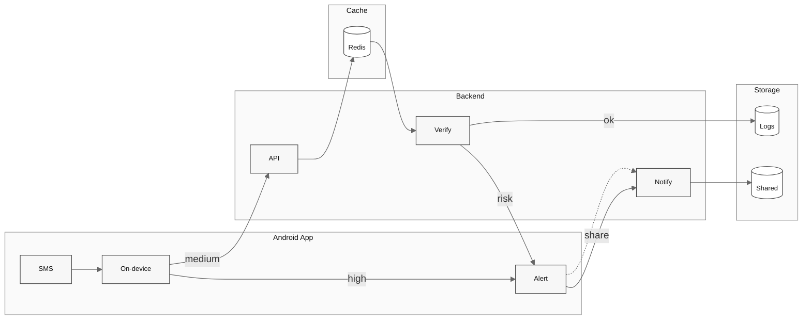
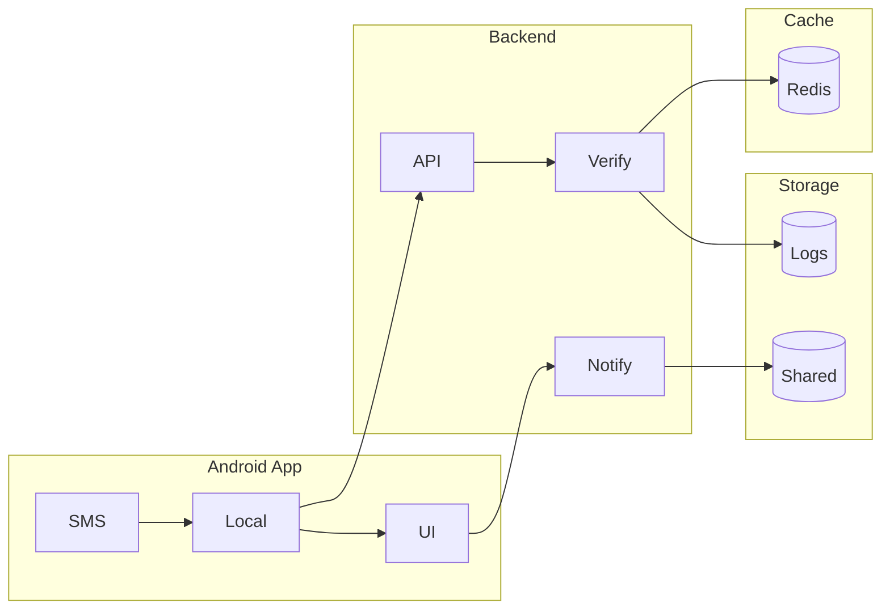

# Guardian SMS

A safety assistant that helps older adults identify scam SMS messages in real-time.

## Overview

Guardian SMS monitors incoming text messages on Android, analyzes them for scam indicators using hybrid AI detection, and alerts both the elderly user and their trusted family members. Messages are analyzed instantly without requiring technical expertise.

**What it solves:** Older adults are disproportionately targeted by SMS scams. Guardian provides instant protection and family oversight without requiring decisions under pressure.

**Target audience:** Senior citizens (protected users) and their family members (guardians).

## How It Works

### Message Monitoring
- **Android app:** Monitors incoming SMS messages in real-time
- **Local detection:** On-device rules engine (<50ms)
- **Backend verification:** ML analysis for uncertain cases (200ms)

### Analysis
- Hybrid detection: Local rules engine + Backend ML classifier
- Rule-based patterns: urgency language, suspicious links, money requests, impersonation
- Pretrained BERT model for scam/phishing detection
- Redis caching for fast repeated pattern detection

### Results
- Risk level (Safe / Medium Risk / High Risk)
- Warning signs identified in the message
- Safe next steps in plain language
- Real-time alerts to protected user

### Alerts
Guardian automatically notifies trusted family members when high-risk scams are detected. Medium-risk messages prompt the user to share. Family members can view shared messages with user consent to verify false positives.

## Privacy & Safety

- **Metadata-only storage** - Raw message content never stored permanently
- **Encrypted sharing** - Messages shared with family are encrypted (AES-256)
- **Auto-expiration** - Logs deleted after 7 days, shared messages after 48 hours or viewing
- **User control** - Protected users control guardian access levels
- **No modifications** - Original messages in system SMS app never touched

## Tech Stack

| Layer | Technology |
|-------|------------|
| Mobile App | Kotlin (Android) |
| Backend | FastAPI (Python) |
| Database | PostgreSQL |
| Cache | Redis |
| ML | HuggingFace BERT classifier |
| Infrastructure | Railway / Render |

## Architecture







## Local Setup

### Requirements
- Python 3.11+
- PostgreSQL 15+
- Redis 7+
- Android Studio (latest)

### Run Locally

```bash
# Backend
cd backend
python -m venv venv
source venv/bin/activate
pip install -r requirements.txt
alembic upgrade head
uvicorn app.main:app --reload

# Android
# Open android/ in Android Studio
# Update API URL in strings.xml
# Build and run on emulator/device
```

## License

MIT
