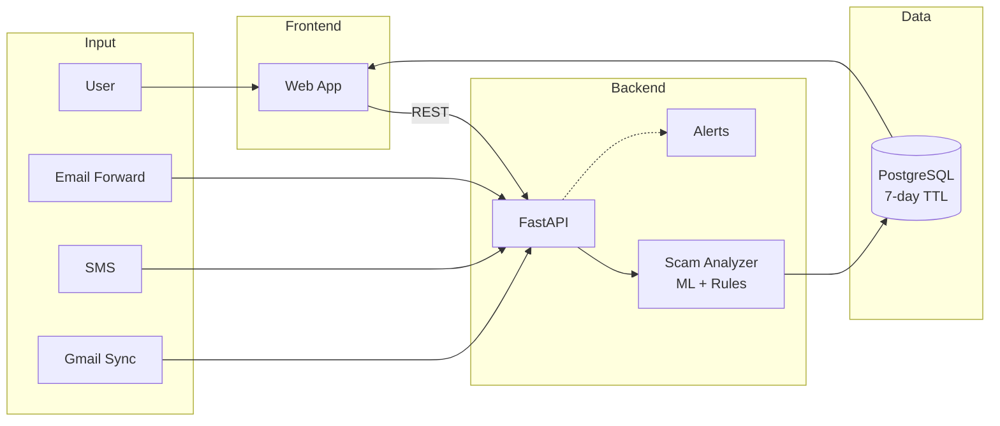

```mermaid
graph LR
  subgraph Input
    U[User]
    E[Email Forward]
    S[SMS]
    G[Gmail Sync]
  end

  subgraph Frontend
    UI[Web App]
  end

  subgraph Backend
    API[FastAPI]
    A[Scam Analyzer<br/>ML + Rules]
    AL[Alerts]
  end

  subgraph Data
    DB[(PostgreSQL<br/>7-day TTL)]
  end

  U --> UI
  UI -->|REST| API
  E --> API
  S --> API
  G --> API
  API --> A
  A --> DB
  DB --> UI
  API -.-> AL
```
